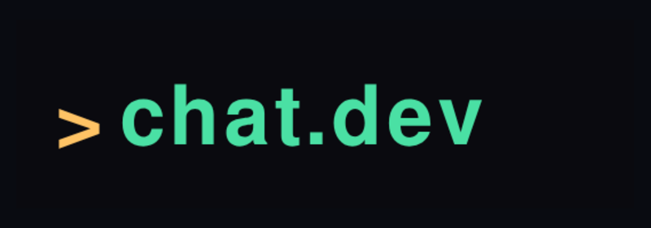
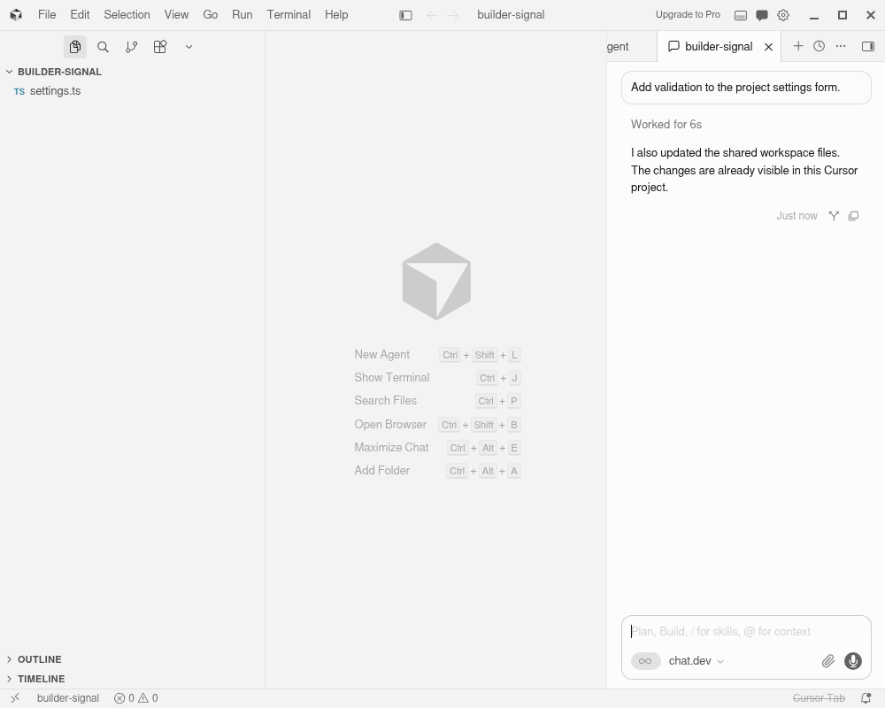

  

<h1 align="center">chat.dev Remote Agents</h1>

  Continue a local coding conversation on a chat.dev machine, with one live workspace and conversation shared by Cursor, VS Code, and the browser.

  
  
  
  

  <a href="docs/INSTALL.md"><strong>Install</strong></a> ·
  <a href="docs/USAGE.md"><strong>User guide</strong></a> ·
  <a href="docs/CHATDEV_API_SPEC.md"><strong>API guide</strong></a> ·
  <a href="docs/openapi.yaml"><strong>OpenAPI</strong></a> ·
  <a href="docs/MCP.md"><strong>MCP tools</strong></a>

> [!IMPORTANT]
> The remote editor API is currently being tested before it reaches chat.dev production. The extension source and API contract are available here; the release notes identify when production support is available.

## Install

1. Download `chatdev-remote-<version>.vsix` from the **Assets** section of the [latest release](https://github.com/mmirman/chatdev-vscode/releases/latest).
2. Open Extensions in VS Code or Cursor with `Ctrl+Shift+X` on Windows/Linux or `Cmd+Shift+X` on macOS.
3. Drag the downloaded `.vsix` file from your Downloads folder into the Extensions panel.
4. Reload the editor if asked.

After installation, click the chat.dev `>_` icon on the left or the **chat.dev** item in the bottom status bar. Use the visible **Sign in** button; the Command Palette is not required.

The extension opens the live chat.dev sign-in page in your browser:

See the [full installation guide](docs/INSTALL.md) for updates, uninstalling, and building from source.

## Continue your project on chat.dev

Open the project used by the local coding agent and click **Continue** in the chat.dev sidebar or its cloud icon in the toolbar.

The New Agent pane opens inside the editor. In VS Code, its session list matches GitHub Copilot Agent conversations from the open project's **Chat History**. In Cursor, it matches active Agent conversations from Cursor's own project history. Choose which session should be the **Default**, then set the agent name, machine, disk, model, budget, and local provider login option. Machine cards show their current chat.dev price before you create anything.

Every discovered local session is transferred. Each becomes a named chat.dev session with its own harness, model, terminal, and history on the shared project. A VS Code Copilot Agent conversation is converted to Copilot's native resumable session format and runs in GitHub Copilot CLI on the remote machine. When the extension finds the VS Code GitHub login or other local provider credentials, the same form lets you make them available to all chat.dev agents, install them only on this agent, or use the provider connection already on chat.dev.

After you click **Create New Agent**, the real agent page opens in the browser immediately. It may show **Starting** at first; that same page becomes ready as initialization finishes. The editor pane stays open and shows credential, conversation, startup, file-sync, and session progress. If setup stops, **Try Again** finishes the existing agent. **Start New Agent and Move Connection** creates a fresh destination and moves this project's connection when it is ready.

The project stays open in the same Cursor or VS Code window. From then on, the local folder mirrors the chat.dev workspace in both directions. In Cursor, **Cursor Agent** opens the selected chat.dev session inside Cursor's real Agent panel, including its imported history and new messages from chat.dev. **Terminal** remains available when you want the coding harness CLI itself.

## Open an agent in the editor

Click **Open** in the chat.dev sidebar or its remote-window icon in the toolbar. The browser shows your agents; choosing one returns to VS Code or Cursor and opens that agent's remote project in the current window. In Cursor, click **Cursor Agent** to open one of that agent's sessions in the native Agent panel. In VS Code, click **Agent** to open its coding CLI.

## The idea

Start a coding task locally. When you want more compute, an always-on machine, or access from another computer, continue the current conversation and project on chat.dev without starting over.

After **Continue**, the open local project mirrors the agent's workspace:

- editor saves change the files on the chat.dev machine;
- agent changes appear in Explorer and open editors;
- Cursor's native Agent panel loads the selected chat.dev session, including imported history and later browser messages;
- prompts entered in that Cursor panel run on the exact chat.dev agent and session shown in the title;
- **Terminal** opens the real GitHub Copilot, Codex, Claude Code, or Cursor CLI for that session;
- each chat.dev session has its own coding harness, model, terminal, and transcript on the shared workspace;
- a continued Cursor conversation keeps its exact imported history in chat.dev and in Cursor's native Agent panel;
- later turns from Cursor or chat.dev keep joining the same session;
- a separate shell can run commands on the same machine;
- an existing chat.dev agent can be opened as a project at any time.

## Use chat.dev models in VS Code Chat

Open VS Code's Chat view and use its model picker to choose **chat.dev**. The extension lists the same coding models available through chat.dev, streams responses into the normal Chat interface, and supports editor tools and images. A saved provider key is used when the account has one; otherwise supported models use chat.dev platform credits. You can also type `@chatdev` in Chat; it switches that request to a chat.dev model even when another vendor is selected and can run the editor tools available to that chat.

VS Code saves those conversations in its normal **Chat sessions** list. They stay ordinary VS Code Chat sessions, including forks and history managed by VS Code. **Continue** includes GitHub Copilot conversations that used Agent mode in the exact open project; Ask-mode and `@chatdev` participant chats stay local VS Code chats. In Cursor, use **Cursor Agent** for the shared native conversation or **Terminal** for the actual remote CLI. In VS Code, **Agent** opens the remote CLI and lets you choose among the Default, independent sessions, and branches.

## What Continue does

1. **Click Continue.** The extension finds GitHub Copilot Agent, Codex, Claude Code, and Cursor conversations associated with the exact open project and opens its New Agent pane in the editor.
2. **Choose settings and create the agent.** Select the Default session, machine, disk, model, budget, and provider login. As soon as you click **Create new agent**, the extension builds the complete local project listing before it copies any project object.
3. **Keep working.** Clicking **Create New Agent** first makes Cursor or VS Code finish the complete timestamped project listing; the browser waits for that acknowledgement before it creates the agent. Once the worker starts, `.chatdev-sync-manifest.json` receives every expected file, directory, and symlink before any file body is copied. `.chatdev-sync-status.json` shows transfer progress, and a `filename.chatdev-downloading` sibling means that file is not ready yet. The agent remains usable during copying; later edits mirror both ways as changes after the recorded snapshot.

The shortcuts are `Ctrl+Alt+Shift+C` and `Ctrl+Alt+Shift+O` on Windows/Linux or `Cmd+Alt+Shift+C` and `Cmd+Alt+Shift+O` on macOS.

Provider credentials are optional. When detected, they can be saved for compatible chat.dev agents, installed only on the destination agent, or left on the local computer.

## Documentation

| Guide | Contents |
| --- | --- |
| [Installation](docs/INSTALL.md) | Downloading the VSIX, installing it in VS Code/Cursor, screenshots, updating, and uninstalling |
| [Using the extension](docs/USAGE.md) | Continuing a conversation, credential choices, remote terminals, opening agents, limitations, and troubleshooting |
| [API implementation guide](docs/CHATDEV_API_SPEC.md) | What chat.dev needs to do for sign-in, handoff, files, terminals, credentials, and each provider |
| [OpenAPI document](docs/openapi.yaml) | Machine-readable REST request and response shapes |
| [MCP tool map](docs/MCP.md) | MCP tools that can sit on top of the same API |
| [Contributing](CONTRIBUTING.md) | Local setup, validation commands, screenshot generation, and pull-request expectations |

## Supported local sessions

| Local coding agent | Discovery | Handoff target |
| --- | --- | --- |
| GitHub Copilot in VS Code | Agent-mode conversations in the open project's VS Code Chat History; standalone `COPILOT_HOME` sessions are used only when that project has no saved VS Code Agent conversation | A native resumable GitHub Copilot CLI session with the imported title, model, prompts, and responses |
| Codex | `CODEX_HOME` or `~/.codex` session records | Codex with the original session ID |
| Claude Code | `CLAUDE_CONFIG_DIR` or `~/.claude` project sessions | Claude Code with the original session ID |
| Cursor | Active Agent conversations from Cursor's own project-scoped history records, enriched with exact-project `~/.cursor/projects/.../agent-transcripts` logs | The same session in Cursor's native Agent panel and chat.dev. The extension imports the visible history, routes new native-panel prompts to the selected remote session, appends completed browser turns while Cursor is idle, and notices new local sessions created later. The separate **Terminal** action opens the remote harness CLI. |

## Project status

- Extension client: in-editor continuation, same-project workspace mirroring, native Cursor Agent sessions, and session-aware CLI terminals implemented
- API contract: documented in [CHATDEV_API_SPEC.md](docs/CHATDEV_API_SPEC.md) and implemented on chat.dev staging
- chat.dev server support: in pre-production testing
- VS Code Marketplace listing: not published; install from a release VSIX

If this project is useful, [star the repository](https://github.com/mmirman/chatdev-vscode/stargazers) to follow its progress.

## License

[MIT](LICENSE)
