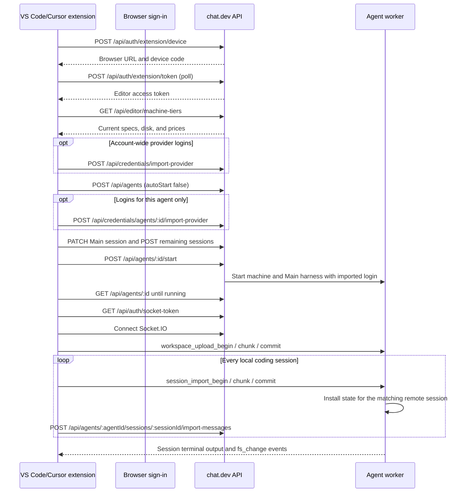

# chat.dev editor API implementation guide

**Status:** Implemented on a chat.dev feature branch for pre-production testing.

This document explains what the chat.dev server must do for the VS Code/Cursor extension. For machine-readable REST shapes, see [openapi.yaml](openapi.yaml). For an MCP interface over the same operations, see [MCP.md](MCP.md).

## What the API enables

The extension has two main workflows:

1. **Continue a local project on chat.dev:** the extension discovers the project's local coding sessions, lets the user choose which one is Main, creates the agent, uploads the workspace and every discovered session, and keeps the original local project open as a two-way mirror.
2. **Open an existing agent:** the browser shows the account's agents. Choosing one returns to the editor, which replaces the current workspace with the agent's remote filesystem. The user opens a coding-agent session with the editor's **Agent** action.

An **agent** owns one machine and one `/workspace` directory. A **session** is one named coding-agent conversation on that machine, with its own harness process, tmux session, terminal, status, and ordered history. Several sessions can edit the same workspace concurrently. A branch starts with a copy of its parent history; runtimes with a native fork operation also inherit the parent runtime context.

An agent always has a Main session. Its session ID equals the agent ID so older clients continue to address the original conversation without a separate lookup.

## Components

| Component | Job |
| --- | --- |
| VS Code/Cursor extension | Find local sessions, show continuation settings, upload files, handle browser callbacks, and implement the virtual filesystem and terminals |
| chat.dev web app | Complete editor sign-in and show the account-aware agent picker |
| chat.dev REST API | Sign the editor in, coordinate browser handoffs, manage agents and sessions, store exact histories, and save account-wide provider credentials |
| chat.dev Socket.IO gateway | Carry file, session-terminal, upload, and session-handoff messages between the extension and worker |
| Agent worker | Own `/workspace` and run one isolated harness/tmux pair for every active session |

## Complete handoff sequence



If an upload or session step fails, the agent remains on the account. The editor form reports the failed step and retries against the same created agent when the user submits the unchanged settings again.

## REST API

Base URL: `https://api.chat.dev`

### Endpoint summary

| Method | Path | What the server does |
| --- | --- | --- |
| `POST` | `/api/auth/login-options` | Tell the browser whether to show password entry before sending a sign-in code |
| `POST` | `/api/auth/extension/device` | Create a browser sign-in request for this editor |
| `POST` | `/api/auth/extension/approve` | Connect the signed-in browser user to the waiting editor |
| `POST` | `/api/auth/extension/token` | Report whether browser sign-in finished and return the editor token |
| `DELETE` | `/api/auth/extension/token` | End the current editor session |
| `GET` | `/api/auth/socket-token` | Return a token accepted by the Socket.IO gateway |
| `POST` | `/api/editor-handoffs` | Create the browser-based Open flow or a compatible legacy Continue flow |
| `GET` | `/api/editor-handoffs/:token` | Return browser choices and current transfer state |
| `POST` | `/api/editor-handoffs/:token/complete` | Record choices from the compatible browser-led Continue flow |
| `POST` | `/api/editor-handoffs/:token/select-agent` | Record the agent chosen in the browser picker and return the editor callback URI |
| `POST` | `/api/editor-handoffs/:token/progress` | Record upload progress, completion, or failure |
| `POST` | `/api/editor-handoffs/:token/retry` | Request another upload and return the editor callback URI |
| `POST` | `/api/editor-handoffs/:token/replace-agent` | Clear a failed handoff's old agent and return the New Agent page for the same local project and sessions |
| `GET` | `/api/editor-handoffs/agents/:agentId/open-url` | Return the agent page URL for a completed in-editor Continue flow |
| `GET` | `/api/agents` | Return agents the extension can open |
| `GET` | `/api/agents/:agentId` | Return current status and runtime for one agent |
| `POST` | `/api/agents` | Create an agent with the requested machine, disk, and coding runtime |
| `POST` | `/api/agents/:agentId/start` | Start a stopped agent |
| `DELETE` | `/api/agents/:agentId` | Delete an agent when the user explicitly requests deletion |
| `GET` | `/api/agents/:agentId/sessions` | List the named coding sessions running in one workspace |
| `POST` | `/api/agents/:agentId/sessions` | Create a session or branch with its own harness and model |
| `PATCH` | `/api/agents/:agentId/sessions/:sessionId` | Change a session's name, harness, model, or imported source ID |
| `POST` | `/api/agents/:agentId/sessions/:sessionId/start` | Start a stopped session |
| `POST` | `/api/agents/:agentId/sessions/:sessionId/stop` | End a session's current harness process without deleting its history |
| `POST` | `/api/agents/:agentId/sessions/:sessionId/restart` | Restart one session's harness process |
| `DELETE` | `/api/agents/:agentId/sessions/:sessionId` | Delete a non-Main session and its history |
| `GET` | `/api/agents/:agentId/sessions/:sessionId/messages` | Read exact ordered user and agent messages for one session |
| `POST` | `/api/agents/:agentId/sessions/:sessionId/messages` | Send a prompt to one session |
| `POST` | `/api/agents/:agentId/sessions/:sessionId/messages/:messageId/branch` | Replace one user prompt in a new child branch |
| `POST` | `/api/agents/:agentId/sessions/:sessionId/import-messages` | Import exact editor history into one session |
| `POST` | `/api/credentials/import-provider` | Save provider values for compatible agents on the account |
| `POST` | `/api/credentials/agents/:agentId/import-provider` | Store provider values on a stopped destination before its first start |
| `GET` | `/api/editor/language-models` | Return chat.dev models for VS Code's built-in chat model picker |
| `POST` | `/api/editor/language-models/chat-stream` | Run one built-in editor chat request with the selected chat.dev model |
| `GET` | `/api/editor/machine-tiers` | Return current machine specs, included disk, and monthly prices for the Continue form |

### 1. Start editor sign-in

`POST /api/auth/extension/device`

Request:

```json
{
  "codeChallenge": "base64url-value",
  "clientName": "Cursor on macOS"
}
```

The server creates a short user code and a browser page where the user completes sign-in.

Response:

```json
{
  "deviceCode": "device-code",
  "userCode": "ABCD-EFGH",
  "verificationUriComplete": "https://chat.dev/connect/vscode?code=ABCD-EFGH",
  "interval": 5,
  "expiresAt": "2026-07-12T21:00:00Z"
}
```

### 2. Complete the browser step automatically

Before the normal login form sends a code, it calls `POST /api/auth/login-options` with `{ "identifier": "user@example.com" }`. The server returns `{ "hasPassword": true, "method": "email" }` for a password account, so the form can show password entry immediately. Accounts without a password continue through the existing code or instant-account-creation behavior.

After the browser has a signed-in chat.dev user, `/connect/vscode` immediately calls `POST /api/auth/extension/approve` with `{ "userCode": "ABCD-EFGH" }`. A successful response is `{ "ok": true, "clientName": "Cursor on macOS" }`. The user never has to copy the editor code or click a second Connect button.

### 3. Finish editor sign-in

`POST /api/auth/extension/token`

Request:

```json
{
  "deviceCode": "device-code",
  "codeVerifier": "verifier-value"
}
```

Return HTTP `428` while the browser step is pending. After it finishes:

```json
{
  "accessToken": "editor-token"
}
```

`DELETE /api/auth/extension/token` ends the editor session. `GET /api/auth/socket-token` returns `{ "token": "socket-token" }` for the realtime connection.

### 4. Create a compatible browser handoff

Continue now creates the agent directly from the editor form. These endpoints remain available for older extension releases and for the browser-based Open picker.

`POST /api/editor-handoffs` accepts either workflow. A Continue request contains the local project and every session discovered by the extension:

```json
{
  "kind": "continue",
  "callbackUri": "cursor://chatdev.chatdev-remote/continue",
  "projectName": "payments-api",
  "projectPath": "/Users/me/code/payments-api",
  "conversations": [
    {
      "id": "conversation-id",
      "title": "Fix payment retries",
      "provider": "codex",
      "runtime": "codex-tmux",
      "mtime": 1783971000000,
      "credentialSources": ["Codex login"]
    }
  ]
}
```

The response includes a browser URL:

```json
{
  "token": "edh_random-value",
  "browserUrl": "https://agent.chat.dev/agents/new?editorHandoff=edh_random-value",
  "expiresAt": "2026-07-13T22:00:00Z"
}
```

An Open request only needs `{ "kind": "open", "callbackUri": "vscode://chatdev.chatdev-remote/open" }`. Its browser URL points to `/connect/editor/agents`.

`GET /api/editor-handoffs/:token` returns the project, sessions, selected agent, whether that agent still exists (`agentAvailable`), Main session ID, credential scope, status, progress message, error, and expiry. Both the editor access token and the signed-in browser session can read the same record for the same account.

### 5. Complete or retry a browser handoff

An older browser-led Continue form calls:

```json
POST /api/editor-handoffs/:token/complete
{
  "agentId": "agent-id",
  "mainSessionId": "conversation-id",
  "credentialScope": "global"
}
```

The extension polls the handoff, sees the selected agent and Main session, and starts the transfer of every discovered session. It reports `uploading`, `complete`, or `failed` to `/progress` with a browser-readable message. `/retry` first verifies that the old agent still exists, then changes a failed transfer to `retry_requested` and returns a `vscode://` or `cursor://` callback that wakes the extension.

`POST /api/editor-handoffs/:token/replace-agent` is the explicit recovery path when the user wants a different machine or the previous agent was deleted. It clears `agentId`, `mainSessionId`, the old error, and the selected credential scope without discarding the local project or session list. It returns `{ "browserUrl": ".../agents/new?editorHandoff=..." }`; completing that form attaches the new agent to the same handoff. `conversationId` remains accepted as an older-client alias for `mainSessionId`.

For Open, the browser calls `/select-agent` with `{ "agentId": "agent-id" }`. The returned callback opens the agent's workspace in the current editor window. The user opens the coding-agent CLI explicitly with **Agent**.

### 6. List and inspect agents

`GET /api/agents` returns:

```json
{
  "agents": [
    {
      "id": "agent-id",
      "name": "payments-api",
      "status": "running",
      "statusSummary": "Ready",
      "agentRuntime": "codex-tmux",
      "machineSize": "pro"
    }
  ]
}
```

`GET /api/agents/:agentId` returns the same shape for one agent. The extension recognizes `starting`, `running`, `errored`, `stopped`, and `deleted`.

### 7. Create the handoff destination

`POST /api/agents`

```json
{
  "name": "payments-api",
  "agentRuntime": "codex-tmux",
  "machineSize": "pro",
  "volumeGb": 20,
  "model": "optional-model",
  "autoStart": false
}
```

The server creates the agent record and workspace volume and returns the new agent object. Continue uses `autoStart: false` so it can install provider logins and define all sessions before the first harness process starts. Clients that omit `autoStart` retain the existing create-and-start behavior.

`GET /api/editor/machine-tiers` returns the current choices rendered by the extension:

```json
{
  "tiers": [
    {
      "id": "pro",
      "label": "Pro",
      "cpuKind": "shared",
      "cpus": 4,
      "memoryMb": 4096,
      "volumeGb": 10,
      "monthlyUsd": 39
    }
  ]
}
```

The extension falls back to its bundled catalog when this additive endpoint is not present, so installing the client does not require a synchronized server rollout.

Remote handoff behavior:

| Local conversation | Remote behavior |
| --- | --- |
| `codex-tmux` | Resume the imported Codex session ID |
| `claude-code-tmux` | Resume the imported Claude Code session ID |
| Cursor editor conversation with Cursor credentials | Create `cursor-agent-tmux`, import the visible editor history, and continue it in a durable remote Cursor CLI session |
| Cursor editor conversation without Cursor credentials | Create `codex-tmux` and import the visible Cursor transcript as prior context |

`POST /api/agents/:agentId/start` starts an existing stopped agent. The extension polls the agent until its status becomes `running` or `errored`.

### 8. Save account-wide provider credentials

`POST /api/credentials/import-provider`

```json
{
  "provider": "cursor",
  "values": {
    "CURSOR_AUTH_JSON": "{...}"
  }
}
```

Return the accepted names:

```json
{
  "keys": ["CURSOR_AUTH_JSON"]
}
```

Provider values used by the extension:

| Provider | Values |
| --- | --- |
| `codex` | `CODEX_AUTH_JSON`, `OPENAI_API_KEY` |
| `claude` | `CLAUDE_CREDENTIALS_JSON`, `CLAUDE_CODE_OAUTH_TOKEN`, `ANTHROPIC_AUTH_TOKEN`, `ANTHROPIC_API_KEY` |
| `cursor` | `CURSOR_AUTH_JSON`, `CURSOR_API_KEY` |

When the user chooses **This agent only**, the extension sends the same provider/value body to `POST /api/credentials/agents/:agentId/import-provider` before starting the stopped agent. This stores the values on that destination so its first harness process can use them. For an already-running agent, the compatible `credential_import` Socket.IO event installs updated values and restarts the affected runtime when needed.

### 9. Provide chat.dev models to VS Code chat

The extension registers a VS Code `LanguageModelChatProvider` under the `chatdev` vendor. VS Code calls the extension when the built-in Chat view needs model choices or a response. The extension forwards those calls to chat.dev using the signed-in editor token.

`GET /api/editor/language-models`

Returns the models this account may select in VS Code's built-in Chat view:

```json
{
  "models": [
    {
      "id": "openai/gpt-5.5",
      "name": "GPT-5.5",
      "provider": "openai",
      "family": "gpt-5.5",
      "version": "openai/gpt-5.5",
      "maxInputTokens": 200000,
      "maxOutputTokens": 32768,
      "capabilities": {
        "toolCalling": true,
        "imageInput": true
      }
    }
  ]
}
```

The server should include all normal chat.dev model choices. If a model requires provider setup, the chat request can return a useful error for that model rather than hiding the model from the picker.

`POST /api/editor/language-models/chat-stream`

Request:

```json
{
  "model": "openai/gpt-5.5",
  "messages": [
    {
      "role": "user",
      "content": [
        { "type": "text", "text": "Explain this file." }
      ],
      "name": "Alex"
    }
  ],
  "options": {
    "temperature": 0.2,
    "maxOutputTokens": 4096,
    "tools": []
  }
}
```

Response is newline-delimited JSON with one event per line:

```json
{"type":"text","text":"This file"}
{"type":"text","text":" registers"}
{"type":"done"}
```

Supported response events:

| Type | Meaning |
| --- | --- |
| `text` | Append text to the VS Code chat response |
| `tool_call` | Invoke a VS Code tool with `callId`, `name`, and `input` |
| `error` | Stop the request and show the returned message |
| `done` | End of response |

The extension should send VS Code cancellation to this request using `AbortController`.

### 10. Read and import the Main transcript

`GET /api/chat/:agentId/messages?limit=200`

This compatibility endpoint returns projected conversation rows for the Main session. New clients should use the exact session-history endpoint in the next section.

```json
{
  "messages": [
    {
      "id": 123,
      "role": "user",
      "content": "Fix the test failure",
      "createdAt": "2026-07-13T20:45:00.000Z"
    }
  ],
  "oldestId": 123,
  "hasMoreOlder": false
}
```

`POST /api/chat/:agentId/import-messages`

After a Codex or Claude Code session file is uploaded, or after a Cursor chat is read from the editor's local history database, the extension sends parsed user/assistant messages so chat.dev's normal conversation view can show the imported history.

```json
{
  "provider": "codex",
  "sessionId": "local-session-id",
  "messages": [
    { "role": "user", "content": "Fix the test failure", "createdAt": "2026-07-13T20:45:00.000Z" },
    { "role": "assistant", "content": "I updated the failing assertion.", "createdAt": "2026-07-13T20:47:00.000Z" }
  ]
}
```

Return:

```json
{ "imported": 2 }
```

### 11. Manage sessions in one workspace

`GET /api/agents/:agentId/sessions` returns every session on the machine. Main appears first.

```json
{
  "sessions": [
    {
      "id": "agent-id",
      "agentId": "agent-id",
      "name": "Main",
      "runtime": "cursor-agent-tmux",
      "model": "gpt-5.6",
      "status": "running",
      "isMain": true,
      "parentSessionId": null,
      "forkedFromMessageId": null,
      "forkThroughRuntimeTurnId": null,
      "branchKind": "main",
      "createdAt": "2026-07-15T18:00:00.000Z",
      "updatedAt": "2026-07-15T18:04:00.000Z"
    }
  ]
}
```

Create an independent session with its own harness and model:

```http
POST /api/agents/agent-id/sessions
Content-Type: application/json

{ "name": "Try another approach", "runtime": "cursor-agent-tmux", "model": "gpt-5.6", "start": true }
```

Create a branch from an existing session:

```http
POST /api/agents/agent-id/sessions
Content-Type: application/json

{ "name": "Keep the SQLite design", "parentSessionId": "parent-session-id", "start": true }
```

The server copies the parent's ordered history before returning the branch. Codex uses its app-server `thread/fork` method, Claude Code uses `--fork-session`, and OpenCode uses its session fork endpoint. Cursor Agent and runtimes without a native fork receive the copied history as context on their first turn and then keep a separate durable session.

Edit an earlier user prompt without changing its existing branch:

```http
POST /api/agents/agent-id/sessions/parent-session-id/messages/482/branch
Content-Type: application/json

{ "content": "Keep the PostgreSQL design instead.", "name": "PostgreSQL version", "start": true }
```

The child copies only messages before message `482`, inserts the replacement prompt, records `forkedFromMessageId`, and starts from the closest supported runtime checkpoint. The original prompt and response remain unchanged on the parent.

Rename, resume, end, or delete a session:

```text
PATCH  /api/agents/:agentId/sessions/:sessionId       { "name": "New name", "runtime": "codex-tmux", "model": "gpt-5.6" }
POST   /api/agents/:agentId/sessions/:sessionId/start
POST   /api/agents/:agentId/sessions/:sessionId/stop
POST   /api/agents/:agentId/sessions/:sessionId/restart
DELETE /api/agents/:agentId/sessions/:sessionId
```

The agent Start and Stop controls operate on the whole machine. Machine Stop pauses every active session without changing which sessions are active, and Machine Start reopens that active set. Ending a non-Main session stops only its harness/tmux pair and keeps its history; Resume starts that pair again. Main follows the machine lifecycle and cannot be ended or deleted separately. A session with child branches cannot be deleted until its children are deleted.

Read one exact history page:

```http
GET /api/agents/agent-id/sessions/session-id/messages?limit=100&beforeId=500
```

```json
{
  "messages": [
    {
      "id": 482,
      "agentId": "agent-id",
      "sessionId": "session-id",
      "role": "user",
      "content": "Keep the API additive.",
      "kind": "user_message",
      "phase": null,
      "runtimeTurnId": "turn-id",
      "streamId": null,
      "append": false,
      "createdAt": "2026-07-15T18:05:00.000Z"
    }
  ],
  "oldestId": 482,
  "hasMoreOlder": true
}
```

`POST /api/agents/:agentId/sessions/:sessionId/messages` accepts `{ "message": "...", "clientMessageId": "stable-send-id" }`, records the user turn before dispatch, starts the machine or selected session when needed, and routes the prompt only to that harness. Clients reuse `clientMessageId` when retrying the same send so the exact session log retains one user row.

`POST /api/agents/:agentId/sessions/:sessionId/import-messages` accepts the same `provider`, source `sessionId`, and `messages` body as the Main compatibility importer. Import keys include provider, source session, position, and role, so polling the same local transcript updates history without duplicating it. A Cursor import also refreshes that session's context file. It does not place the source editor ID into Cursor CLI storage.

### Text, calls, and agent tools

Every message route resolves one explicit session before dispatch:

- Direct texts remember an agent and session per SMS conversation. `/sessions` lists choices and `/session NAME` changes only that text conversation's target.
- A browser call starts on the session selected in the agent page. Voice tools accept `sessionName`, can list and rename sessions, and keep the current agent/session pair while the call continues.
- Agent-to-agent send, read, status, and wait tools accept `sessionId` or exact `sessionName`. Omitting both means Main.
- Session creation, branch, rename, resume, end, and delete tools always require an agent and explicit session identifiers where applicable.

Completion delivery is keyed by both agent ID and session ID. A response from one session cannot consume the pending reply for another session on the same machine.

## Socket.IO gateway

The extension gets a socket token, then connects to the API origin:

```ts
io(serverUrl, {
  transports: ["websocket"],
  auth: { token }
});
```

Request events use an acknowledgement callback:

```json
{ "ok": true, "resultField": "value" }
```

or:

```json
{ "ok": false, "error": "What failed" }
```

### Virtual filesystem

The worker applies these operations to the agent's `/workspace` directory. Paths are relative POSIX paths such as `src/server.ts`.

| Event | What it does | Result |
| --- | --- | --- |
| `list_dir` | List one directory | Entry names and file types |
| `stat_path` | Read file metadata | Type, byte size, creation time, modification time |
| `read_file` | Read a file | Base64 data |
| `write_file` | Create or replace a file | Success |
| `create_dir` | Create a directory | Success |
| `delete_path` | Delete a file or directory | Success |
| `rename_path` | Move or rename a path | Success |
| `fs_change` | Tell the editor that worker files changed | Agent ID and changed paths |

`fs_change` is a server event rather than a request. It lets edits made by the coding agent appear in Explorer and open editor tabs.

### Coding-agent terminal

These events connect the VS Code terminal to the actual coding-agent interface on the worker.

| Event | Direction | Purpose |
| --- | --- | --- |
| `join` | Extension → server | Attach to `{ agentId, sessionId }` |
| `leave` | Extension → server | Detach from one session terminal |
| `stdin` | Extension → server | Send terminal input to `{ agentId, sessionId }` |
| `resize` | Extension → server | Change one session terminal's columns and rows |
| `refresh_terminal` | Extension → server | Request the current screen and scrollback for one session |
| `tmux_scroll` | Extension → server | Scroll the selected session's coding-agent TUI |
| `output` | Server → extension | Stream output tagged with `agentId` and `sessionId` |
| `scrollback` / `scrollback_chunk` | Server → extension | Send stored output tagged with both IDs |
| `session_terminal_ready` | Server → extension | Report that a session's coding-agent TUI is ready |
| `session_status` | Server → extension | Report `starting`, `running`, `stopped`, or `errored` |
| `session_message` | Server → extension | Send the complete inserted or updated exact-history row |

Older clients may continue listening for `terminal_ready`, `thread_status`, and `thread_message`; the server emits those aliases with the same payload while the session API is adopted.

### Independent remote shell

The remote shell is separate from the coding-agent interface but uses the same machine and workspace.

| Event | Direction | Purpose |
| --- | --- | --- |
| `shell_open` | Request | Create a shell and return `sessionId` |
| `shell_stdin` | Request | Send input to that shell |
| `shell_resize` | Request | Change its columns and rows |
| `shell_close` | Request | Close it |
| `shell_output` | Server event | Stream shell output |
| `shell_exit` | Server event | Report its exit code |

## Upload the initial workspace

The extension creates one gzip-compressed tar archive for the whole project. It includes hidden files, `.git`, empty directories, file modes, and symlinks unless the user explicitly configured a matching name in `chatdev.uploadExcludes`.

1. `workspace_upload_begin` sends `agentId`, compressed byte `size`, and the local `itemCount`; the server returns `transferId`.
2. `workspace_upload_chunk` sends `transferId`, increasing `sequence`, and `dataBase64`.
3. `workspace_upload_commit` sends `transferId` and the archive's `sha256`.

The worker verifies the byte count and checksum, extracts the archive inside `/workspace`, and returns the extracted `itemCount` and uncompressed file bytes. The extension marks the transfer complete only when the returned item count equals the local manifest count.

The per-path `write_file` and checksummed `file_upload_*` events remain available for normal editor saves and individual large files after the project is open.

## Import and resume each session

### Codex and Claude Code

1. `session_import_begin` declares `agentId`, `targetSessionId`, `runtime`, `provider`, `sourceSessionId`, `localCwd`, byte `size`, and `sha256`. Set `referenceOnly: false`.
2. `session_import_chunk` sends the conversation record in ordered base64 chunks.
3. `session_import_commit` installs the record, changes the recorded working directory to the remote workspace, and resumes the original session ID.

### Cursor conversations

Current Cursor releases export project-linked Agent conversations under `~/.cursor/projects/<project>/agent-transcripts`. The extension reads those JSONL transcripts and correlates their IDs with Cursor's project metadata. Older `state.vscdb` composer records remain a compatibility fallback when no Agent transcript exists.

The extension imports the visible transcript through the target session's `import-messages` endpoint and sends the original Cursor Agent ID as a reference-only source session:

```json
{
  "agentId": "agent-id",
  "targetSessionId": "chatdev-session-id",
  "runtime": "cursor-agent-tmux",
  "provider": "cursor",
  "sourceSessionId": "cursor-chat-id",
  "localCwd": "/local/project",
  "size": 18240,
  "sha256": "sha256-of-rendered-transcript",
  "referenceOnly": true
}
```

The chunks contain a normalized Markdown rendering of the visible Cursor conversation. The worker writes it under `/workspace/.chatdev/sessions/<sessionId>/`. The extension separately imports the same user/assistant turns into that chat.dev session's exact ordered history and keeps importing newly appended local turns idempotently. When a local transcript changes, the extension also rewrites that session's remote context file through `write_file`.

The source Cursor editor ID is correlation metadata only. The worker never passes it to `cursor-agent --resume`, because Cursor's editor and CLI use different session stores.

For `cursor-agent-tmux`, the worker creates one durable remote Cursor Agent session and opens it with the interactive `cursor-agent` TUI. The extension does not rewrite Cursor's editor database. The imported Markdown transcript remains available for chat.dev's exact history projection and as context for the remote session and Codex fallback.

The visible terminal runs `cursor-agent --force --resume <id>`. Simplify sends its prompt to that same TUI process instead of starting a second Cursor CLI. A transcript watcher publishes the ordered user and assistant turns produced by either input surface through the normal chat.dev session stream. The worker caps runtime diagnostics before storing them so a CLI exception cannot turn one bundled source line into a multi-megabyte chat message.

When Cursor credentials are unavailable, that session uses `codex-tmux`. Codex reads the imported transcript before each request and uses the selected chat.dev provider connection or platform credits. The Continue form states which remote harness will continue each session.

After a successful transfer, the extension keeps the original local workspace open and mirrors its files with the agent workspace. The **Agent** action opens any live remote session. Local watchers continue importing new editor turns into their corresponding sessions; remote turns are visible in Simplify and the remote CLI terminal.

## Install credentials only on the destination agent

When the user chooses **This agent only**, the extension creates the agent with `autoStart: false` and calls:

```http
POST /api/credentials/agents/:agentId/import-provider
Content-Type: application/json
```

```json
{
  "provider": "cursor",
  "values": {
    "CURSOR_AUTH_JSON": "{...}"
  }
}
```

Return `{ "keys": ["CURSOR_AUTH_JSON"] }`.

The extension then starts the agent. The login is present when the first harness process launches. `credential_import` remains available over Socket.IO for changing provider values on an already-running agent.

## Failure responses

- REST calls return a non-2xx response with `{ "error": "What failed" }`.
- Socket.IO acknowledgements return `{ "ok": false, "error": "What failed" }`.
- Agent startup failure appears as `status: "errored"` and a useful `statusSummary` from `GET /api/agents/:agentId`.

## Implementation checklist

- [x] Editor sign-in endpoints
- [x] Browser handoff create, read, select, complete, progress, retry, and replace-agent endpoints
- [x] In-editor Main-session selector and transfer progress form
- [x] Browser agent picker with VS Code and Cursor callbacks
- [x] Agent list, read, create, start, and delete endpoints
- [x] Agent session list, create, branch, edited-message branch, rename, resume, end, and delete endpoints
- [x] Exact per-session ordered history and prompt endpoint
- [x] Separate harness, tmux session, terminal stream, and durable runtime state per session
- [x] Native Codex, Claude Code, and OpenCode forks with shared-workspace session isolation
- [x] Explicit session targeting for SMS, calls, and agent-to-agent tools
- [x] Account-wide provider credential endpoint
- [x] Socket token and Socket.IO connection
- [x] Virtual filesystem events and `fs_change`
- [x] Coding-agent terminal events
- [x] Independent shell events
- [x] Large-file upload events
- [x] Complete checksummed workspace archive upload
- [x] Codex session import and resume
- [x] Claude Code session import and resume
- [x] Cursor editor chat transcript import
- [x] Current Cursor transcript discovery and ongoing transcript refresh
- [x] Persistent structured Cursor Agent session shared by Simplify and the remote terminal, with editor transcripts imported into the same chat.dev session and supplied as prior context
- [x] Codex fallback for Cursor conversations without Cursor credentials
- [x] VS Code built-in Chat model catalog and streaming provider API
- [x] Editor machine catalog with specs, included disk, and prices
- [x] Agent-only credential endpoint before first startup and live update event
- [x] VS Code and Cursor end-to-end walkthroughs
