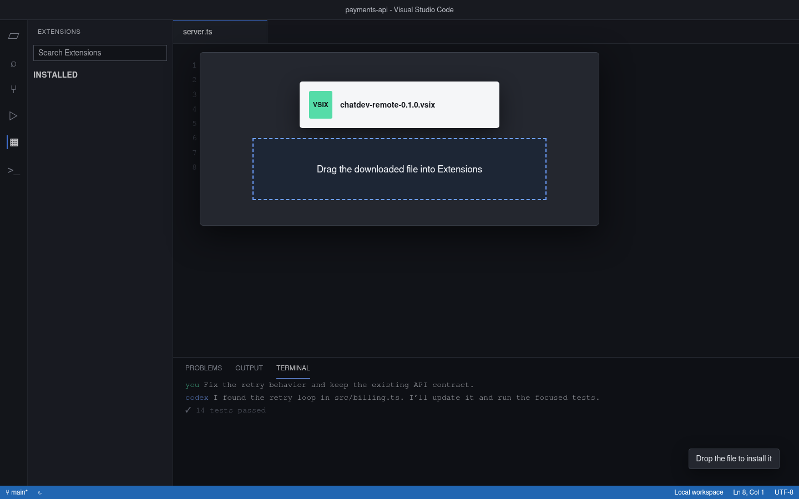
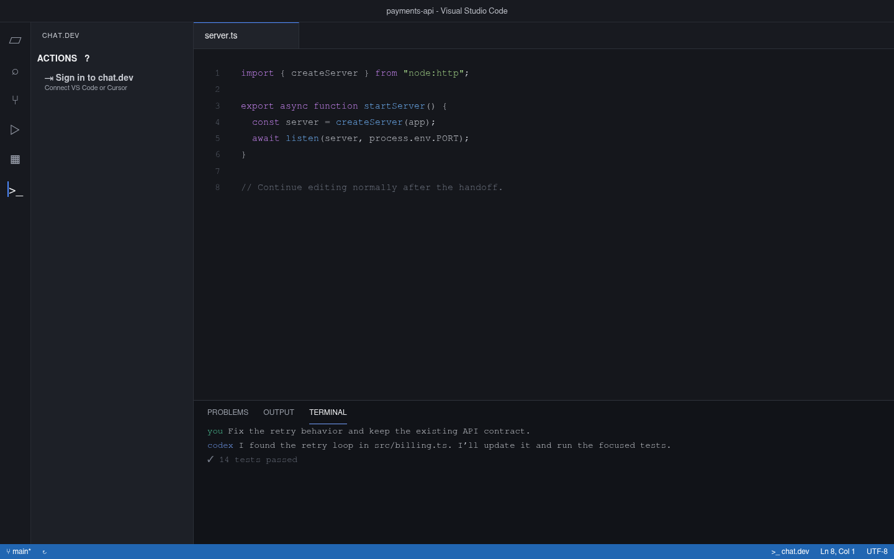
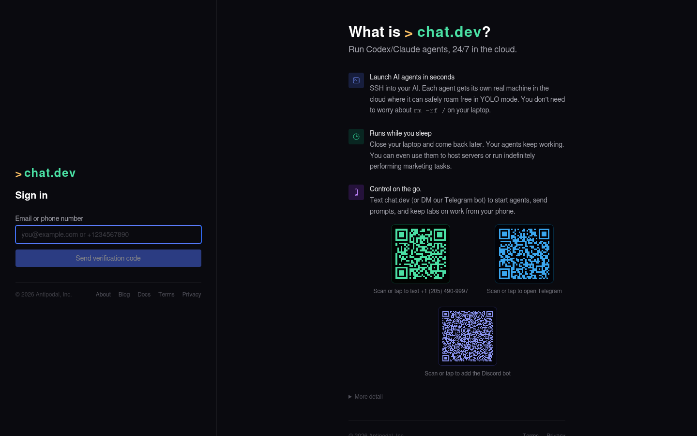

# Installation

This guide installs the chat.dev Remote Agents client in VS Code or Cursor.

> [!NOTE]
> The remote editor API is in pre-production testing. Check the latest release notes for production availability.

## Requirements

- VS Code 1.95 or newer, or a compatible Cursor release
- A downloaded `.vsix` from this repository's Releases page
- A chat.dev account

## 1. Download the extension

1. Open the [latest release](https://github.com/mmirman/chatdev-vscode/releases/latest) in your browser.
2. Scroll down to **Assets**.
3. Click `chatdev-remote-<version>.vsix`.
4. Wait for the download to finish. The file is normally in your **Downloads** folder.

Release assets are built from this public repository. Each release page shows the file size and SHA-256 digest supplied by GitHub.

## 2. Install the VSIX

1. Open VS Code or Cursor.
2. Open Extensions with `Ctrl+Shift+X` on Windows/Linux or `Cmd+Shift+X` on macOS.
3. Open your computer's **Downloads** folder.
4. Drag `chatdev-remote-<version>.vsix` into the Extensions panel.
5. Reload the editor if prompted.



If dragging does not work, use the Extensions panel's **...** menu and choose **Install from VSIX...**.

## 3. Open chat.dev

Click the chat.dev `>_` icon on the left side of the editor. You can also click **chat.dev** in the bottom status bar.

The chat.dev panel has two main actions: **Continue** sends the current project and conversation to a new chat.dev agent, and **Open** brings an existing agent's project and coding conversation into the editor together. Matching icon buttons appear in the panel toolbar.




## 4. Sign in

Click **Sign in to chat.dev** in the chat.dev panel. The extension opens chat.dev in the browser. Sign in normally; the browser connects the editor automatically and tells you when the page can be closed.



Signing in also makes chat.dev models available in VS Code's built-in Chat model picker. You can sign in from the chat.dev panel or choose chat.dev from Chat's **Manage Models** interface.

When you later click **Continue** for a GitHub Copilot Agent conversation, VS Code may ask once whether chat.dev Remote Agents may use your GitHub login. This only makes that login available to the continuation form. The form still lets you choose whether it is installed on all chat.dev agents, installed only on the new agent, or not uploaded.

## 5. Let Cursor connect its Agent panel

This step appears only in Cursor.

The extension connects Cursor's Agent panel automatically on first startup. The current Cursor window reloads once and opens the same project again. You do not need to close Cursor, reopen the project, or run a command.

After the reload, click **Cursor Agent**. Choose a chat.dev agent and session, and it opens as a normal Cursor Agent tab with its existing history. Prompts typed there run on that chat.dev session. Completed messages sent from the chat.dev website appear in the same tab while it is idle.

The extension performs this setup because Cursor's native Agent-provider API is available only to components shipped with Cursor. A Cursor update can replace those files; the extension detects that on startup and reloads the current window once to reconnect it. **chat.dev: Connect Cursor Agent Panel** remains available if an interrupted update needs to be retried manually.

**Terminal** is a different action. It opens the coding harness CLI when you need its terminal interface; it is not the Cursor Agent conversation.

## Update

Download the newer VSIX from [Releases](https://github.com/mmirman/chatdev-vscode/releases) and repeat **Install from VSIX...**. The editor replaces the installed version while retaining its settings.

## Uninstall

1. Open **Extensions**.
2. Find **chat.dev Remote Agents** under installed extensions.
3. Select **Uninstall**.
4. Reload the editor if prompted.

## Build from source

Contributors can build a VSIX locally:

```sh
git clone https://github.com/mmirman/chatdev-vscode.git
cd chatdev-vscode
npm install
npm run package
```

The generated file is written to the repository root. See [CONTRIBUTING.md](../CONTRIBUTING.md) for the full development workflow.
