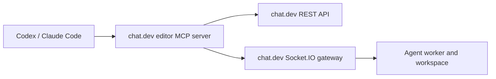

# MCP interface for chat.dev editor operations

This is an optional MCP adapter over the [chat.dev editor API](CHATDEV_API_SPEC.md). The VS Code/Cursor extension talks to REST and Socket.IO directly; the MCP adapter makes the same operations understandable and callable by coding agents.

Starter metadata for the main tools is also available as [mcp-tools.json](mcp-tools.json).

## What the MCP server does

An MCP server receives a tool call, calls the corresponding chat.dev REST endpoint or Socket.IO event, and returns the result as JSON or text.



## Tools

### Agent lifecycle

| MCP tool | What it does | API call |
| --- | --- | --- |
| `chatdev_list_agents` | List editor-capable agents | `GET /api/agents` |
| `chatdev_list_machine_tiers` | List current machine specs, included disk, and prices | `GET /api/editor/machine-tiers` |
| `chatdev_get_agent` | Read one agent and its status | `GET /api/agents/:agentId` |
| `chatdev_create_agent` | Create a destination machine and workspace | `POST /api/agents` |
| `chatdev_start_agent` | Start a stopped agent | `POST /api/agents/:agentId/start` |
| `chatdev_delete_agent` | Delete an agent | `DELETE /api/agents/:agentId` |

### Sessions

| MCP tool | What it does | API call |
| --- | --- | --- |
| `chatdev_list_sessions` | List the named coding sessions and harness states in one workspace | `GET /api/agents/:agentId/sessions` |
| `chatdev_create_session` | Create a session or branch with its own harness and model | `POST /api/agents/:agentId/sessions` |
| `chatdev_update_session` | Change a session's name, harness, or model | `PATCH /api/agents/:agentId/sessions/:sessionId` |
| `chatdev_branch_from_message` | Edit a user prompt into a new child branch | `POST /api/agents/:agentId/sessions/:sessionId/messages/:messageId/branch` |
| `chatdev_manage_session` | Resume, end, restart, or delete one non-Main session | Session lifecycle endpoint matching the requested action |
| `chatdev_get_session_messages` | Read exact ordered history for one session | `GET /api/agents/:agentId/sessions/:sessionId/messages` |
| `chatdev_send_session_message` | Send a prompt to one session's harness | `POST /api/agents/:agentId/sessions/:sessionId/messages` |

The machine Start/Stop tools control the whole agent machine. Stopping the machine pauses its active sessions, and starting it reopens every session that was not explicitly ended. Session tools control one harness. Send, read, wait, and subscription tools default to Main when neither `sessionId` nor `sessionName` is supplied.

### Workspace

| MCP tool | What it does | Socket.IO event |
| --- | --- | --- |
| `chatdev_list_files` | List a workspace directory | `list_dir` |
| `chatdev_stat_file` | Read file metadata | `stat_path` |
| `chatdev_read_file` | Read a workspace file | `read_file` |
| `chatdev_write_file` | Create or replace a workspace file | `write_file` |
| `chatdev_make_directory` | Create a directory | `create_dir` |
| `chatdev_delete_path` | Delete a file or directory | `delete_path` |
| `chatdev_rename_path` | Move or rename a path | `rename_path` |
| `chatdev_upload_file` | Upload a large local file | `file_upload_begin/chunk/commit` |

### Conversation and credentials

| MCP tool | What it does | API call or event |
| --- | --- | --- |
| `chatdev_import_session` | Import resumable Codex or Claude Code state, or attach a Cursor editor transcript to a remote session | `session_import_begin/chunk/commit` |
| `chatdev_import_chat_messages` | Import exact user and assistant rows into one session | `POST /api/agents/:agentId/sessions/:sessionId/import-messages` |
| `chatdev_save_account_credentials` | Save provider values for compatible agents | `POST /api/credentials/import-provider` |
| `chatdev_install_agent_credentials` | Install provider values only on one agent | `credential_import` |

### Editor chat models

| MCP tool | What it does | API call |
| --- | --- | --- |
| `chatdev_list_language_models` | List chat.dev models available to the editor's built-in Chat view | `GET /api/editor/language-models` |
| `chatdev_stream_language_model_chat` | Run a single built-in editor chat request with the selected model | `POST /api/editor/language-models/chat-stream` |

### Terminals

| MCP tool | What it does | Socket.IO event |
| --- | --- | --- |
| `chatdev_open_shell` | Open a shell and return its session ID | `shell_open` |
| `chatdev_write_shell` | Send input to a shell | `shell_stdin` |
| `chatdev_resize_shell` | Resize a shell | `shell_resize` |
| `chatdev_close_shell` | Close a shell | `shell_close` |
| `chatdev_write_agent_terminal` | Send input to one coding-agent session terminal | `stdin` with `agentId` and `sessionId` |

Terminal output is exposed as MCP resources:

- `chatdev://agents/{agentId}/sessions/{sessionId}/terminal`
- `chatdev://agents/{agentId}/sessions/{sessionId}/messages`
- `chatdev://agents/{agentId}/shells/{sessionId}`

Workspace files are exposed as:

- `chatdev://agents/{agentId}/workspace/{path}`

## Example: create a Codex destination

MCP tool call:

```json
{
  "name": "chatdev_create_agent",
  "arguments": {
    "name": "payments-api",
    "runtime": "codex-tmux",
    "machineSize": "pro",
    "volumeGb": 20
  }
}
```

The MCP server calls `POST /api/agents` and returns:

```json
{
  "id": "agent-id",
  "name": "payments-api",
  "status": "starting",
  "agentRuntime": "codex-tmux",
  "machineSize": "pro"
}
```

## Example: resume a Codex chat

```json
{
  "name": "chatdev_import_session",
  "arguments": {
    "agentId": "agent-id",
    "targetSessionId": "agent-id",
    "runtime": "codex-tmux",
    "provider": "codex",
    "sourceSessionId": "codex-session-id",
    "localCwd": "/Users/alex/src/payments-api"
  }
}
```

The MCP server uploads the session record and commits it. The worker resumes:

```sh
codex resume codex-session-id
```

## Example: read a remote file

```json
{
  "name": "chatdev_read_file",
  "arguments": {
    "agentId": "agent-id",
    "path": "src/server.ts"
  }
}
```

Result:

```json
{
  "path": "src/server.ts",
  "encoding": "utf8",
  "content": "export function startServer() { ... }"
}
```

## MCP server configuration

Once an adapter package exists, editor configuration would look like:

```json
{
  "mcpServers": {
    "chatdev-editor": {
      "command": "chatdev-editor-mcp",
      "env": {
        "CHATDEV_API_URL": "https://api.chat.dev",
        "CHATDEV_TOKEN": "editor-token"
      }
    }
  }
}
```

`chatdev-editor-mcp` is a proposed adapter name, not a published package in this repository.
