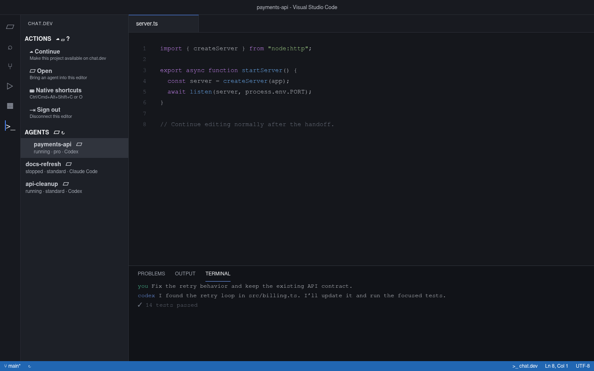
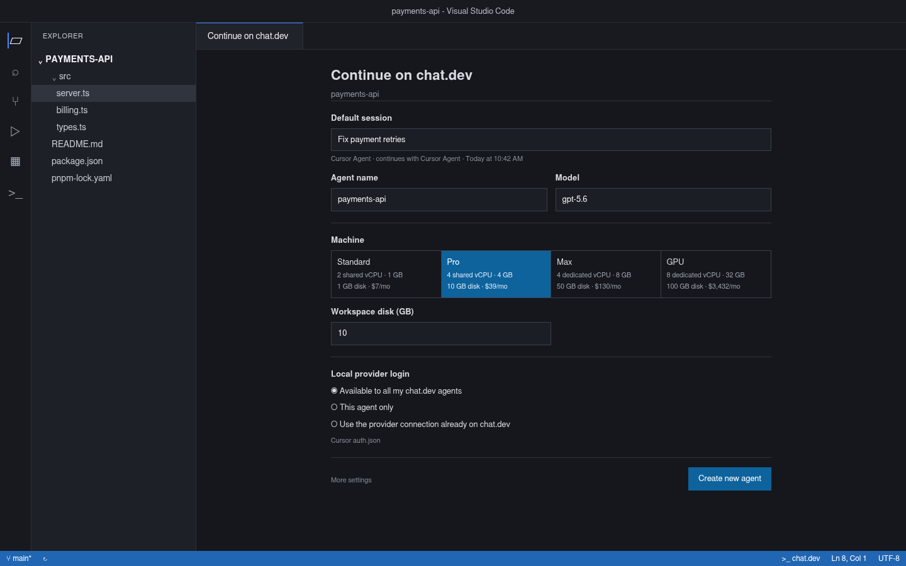
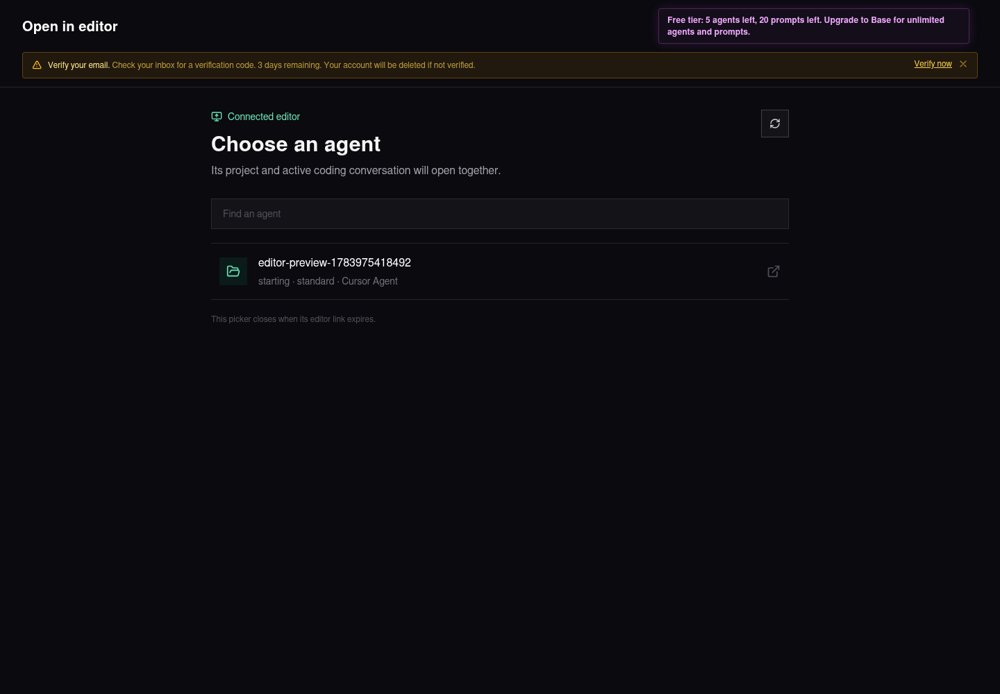
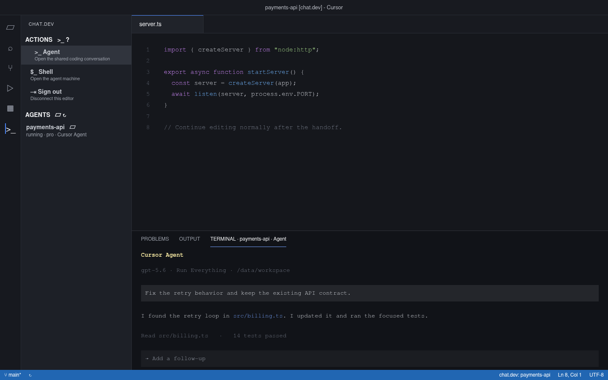

# User guide

## Continue the current project on chat.dev

Open the exact project used by your local Codex, Claude Code, or Cursor conversation.

1. Click the chat.dev `>_` icon on the left side of VS Code or Cursor.
2. Click **Continue**, or click the cloud icon in the chat.dev toolbar.
3. The New Agent pane opens inside the editor with the project and local sessions already attached.
4. Choose which local AI session should be the **Default**. Every session shown in the list will be transferred.
5. Choose the machine, model, disk, budget, and provider login option. Each machine shows its current monthly price and included disk.
6. Click **Create New Agent**. The agent page opens in your browser immediately while the editor shows live setup and transfer progress. Keep the editor open until it finishes.

Each local history entry becomes a separate chat.dev session on the same machine and workspace. Codex sessions continue with Codex and Claude Code sessions continue with Claude Code. A Cursor session uses a persistent remote Cursor Agent when the extension finds a Cursor login or API key. Without one, it uses Codex with chat.dev credits. Both receive the visible Cursor history as prior context.

The local transcript watcher stays attached to each selected Cursor conversation. New local turns continue to reach the exact chat.dev session while the project remains open, and a new active Cursor Agent conversation created in that project becomes another chat.dev session automatically. The extension connects Cursor's native Agent panel automatically on first startup and keeps Cursor's true composer records current instead of showing a second chat-shaped extension view.

After transfer, the Cursor sidebar shows **Cursor Agent**, **Terminal**, and **Shell** without reopening the project. Click **Cursor Agent**, choose a session, and continue in Cursor's normal Agent panel. Browser Simplify and the native Cursor panel update the same chat.dev session. **Terminal** opens that session's coding CLI, while **Shell** opens an ordinary shell on the machine.

In VS Code, the sidebar shows **Agent** and **Shell**. **Agent** opens the coding CLI because VS Code does not include Cursor's Agent panel.

If setup stops after creation, the form stays open and shows the actual failure. Click **Try Again** to finish connecting that agent. Click **Start New Agent and Move Connection** when you want a different agent instead; the old agent stays on your account until you delete it yourself. If the old agent was already deleted, Continue forgets that stale connection and creates a new one.

After a successful transfer, the current project remains open. Its local folder becomes a live mirror of the agent workspace: local saves are sent to chat.dev, and files changed by any chat.dev conversation are pulled back into the editor. Keeping the original folder open also keeps Cursor's native project identity and Agent history in place.

## Local provider credentials

When credentials are available for any discovered session, the editor form offers:

| Choice | Result |
| --- | --- |
| **Make available to all my chat.dev agents** | Save the local provider login on the account for compatible agents. |
| **Install on this agent only** | Install it only on the newly created agent. |
| **Do not upload local credentials** | Leave it on the local computer. |

The extension can find Codex `auth.json`, Claude Code `.credentials.json`, Cursor CLI `auth.json`, the active Cursor editor login, and supported provider values inherited from the editor process.

Choosing the account-wide option both installs the credential on the new machine and saves it for compatible agents created later.

## Use chat.dev models in VS Code Chat

1. Open VS Code's Chat view.
2. Open the model picker at the top of Chat.
3. Choose a model under **chat.dev**.
4. If needed, use **Manage Models** and choose chat.dev to sign in.

The provider supports streamed answers, images, editor tool calls, and cancellation. Saved provider keys are used when available. Supported models otherwise use the chat.dev account's platform credits.

Typing `@chatdev` also routes the request through a chat.dev model when another vendor is selected. The participant carries attached references and its chat history forward and can run the editor tools available to that chat. These conversations appear in VS Code's ordinary Chat sessions list and keep VS Code's normal save, fork, archive, and export behavior. They are separate from Codex, Claude Code, and Cursor coding-agent sessions discovered by **Continue**. Cursor does not load third-party VS Code language-model providers into its model picker, so the extension connects the native Cursor Agent panel directly to a chat.dev session instead.

## Use the native Cursor Agent panel

1. Let the extension complete its automatic one-time Cursor window reload after installation.
2. Click **Cursor Agent** in the chat.dev sidebar or click the chat icon beside any listed agent.
3. Choose a session. Its name, imported user messages, and assistant messages open in a real Cursor Agent tab.
4. Type normally. The prompt runs on that exact chat.dev agent and session.

Messages completed through browser Simplify are appended to the open Cursor conversation while the panel is idle. Website and Cursor prompts are serialized by the chat.dev session so two harness runs do not answer the same turn.

Cursor updates can replace the one-time connection. The extension detects that on startup and reloads the current window once to reconnect it.

## Open an existing agent

1. Click **Open** in the chat.dev panel or click its remote-window toolbar icon.
2. Your browser displays the agents available on your chat.dev account.
3. Click an agent.
4. The browser returns to VS Code or Cursor.
5. The agent's live project replaces the current window and is named after the agent.
6. In Cursor, click **Cursor Agent** and choose a session. In VS Code, click **Agent** to open its coding CLI.

Opening an agent is one operation. There is no separate workspace-versus-session choice.

## Work in the agent project

- Explorer reads the agent's `/workspace` directory.
- Saving a file writes it directly to the agent.
- File changes made by the agent refresh open editors and Explorer.
- **Cursor Agent** opens the shared native conversation; **Terminal** opens the real coding-agent CLI; **Shell** opens an ordinary machine shell.
- Browser Simplify and terminal-originated turns appear in the same chat.dev transcript.
- A Simplify prompt is pasted into the visible Cursor Agent TUI, so the browser and terminal drive one process and one remote conversation.
- Additional chat.dev sessions run separate coding harnesses and terminal sessions while sharing the same agent workspace.
- Stopping the agent machine pauses its active sessions. Starting the machine reopens them; use **End** on one session when it should stay ended.
- Git state moves with the project because `.git` is included by default.
- Closing the editor does not delete the agent or workspace.

An agent opened with **Open** is still a direct remote project. A project created with **Continue** stays local and uses the two-way mirror.

## Edit from the chat.dev website

Open an agent on chat.dev and click a file once. The browser switches to **Workspace** mode with:

- the file tree on the left;
- editor tabs and the code editor in the middle;
- the selected session's Simplify conversation on the right;
- an optional terminal below the editor.

Click another file to open it. Double-click a file in the tree to download it. Browser edits are saved to the same agent workspace and appear in a mirrored Cursor or VS Code project. Local editor changes appear in the browser as well.

On a narrow screen, use the Files, Editor, Simplify, and Terminal tabs to move between the same tools without squeezing them into four columns.

## Edit global variables

Open **Settings > Global variables** on chat.dev. You can add a value, reveal it, edit its name, environment key, value, and description, turn it on or off, or delete it. Multiline values are supported. Account-wide variables are installed for compatible agents you create later.

## Editor shortcuts

The shortcuts run the same Continue form and Open picker without using the sidebar:

| Action | Windows/Linux | macOS |
| --- | --- | --- |
| Continue this project | `Ctrl+Alt+Shift+C` | `Cmd+Alt+Shift+C` |
| Open an agent with the editor picker | `Ctrl+Alt+Shift+O` | `Cmd+Alt+Shift+O` |

The shortcuts are also shown in the chat.dev tool panel. The machine shell remains available as **chat.dev: Open an Agent Machine Shell** in the Command Palette for advanced use.

## What moves

- Workspace files and the Git repository
- Every discovered visible session transcript
- The provider session ID and recorded workspace path
- The provider, coding runtime, and model selection
- Provider credentials when selected
- Open editor tabs and cursor positions

The initial upload sends one checksummed archive containing every project item, including hidden files, `.git`, empty directories, executable modes, and relative symlinks. Absolute local symlinks are omitted because their targets do not exist at the same path on the agent. Set `chatdev.uploadExcludes` only when you intentionally want to leave out named files or directories.

## Troubleshooting

### No conversation appears

Confirm the open project is the directory used by the local Codex, Claude Code, or Cursor conversation. Cursor conversations come from the active Agent entries in Cursor's own history store and their exact-project transcript logs. Open the exact project folder in Cursor and use **Show Chat History** once if no conversation appears. Empty draft chats are omitted.

### The agent picker did not return to the editor

Use the **Open it again** link shown on the agent picker page. Your browser may ask for permission to open VS Code or Cursor.

### The agent exists but the project is missing

Run **Continue** again from the original local project. Use **Try Again** to finish the existing agent, or **Start New Agent and Move Connection** to create a different destination.

### The transfer is still running

Keep the original project window open until the verified archive upload finishes. The status at the bottom of the Continue form shows the current transfer step.

### Cursor Agent is missing

Reload the current Cursor window. If automatic setup was interrupted, run **chat.dev: Connect Cursor Agent Panel** once; the extension reconnects the native panel and reloads the same window.

### A browser turn is not visible in Cursor yet

Finish or stop the prompt currently running in that Cursor Agent tab. The extension appends completed website turns when the panel is idle, preserving their order in the native conversation.

### The coding CLI is blank or stale

Use **Terminal**, not **Cursor Agent**, to open the CLI. Reopen **Terminal** after changing sessions. The terminal attaches to that session's persistent harness process rather than replaying the Simplify transcript as terminal text.
